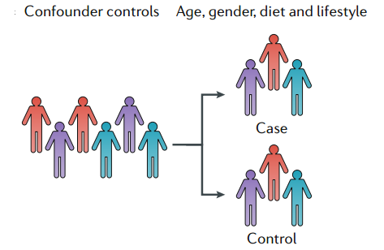
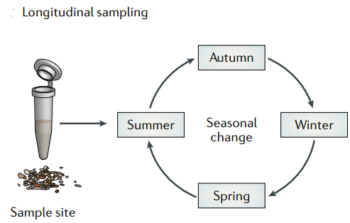
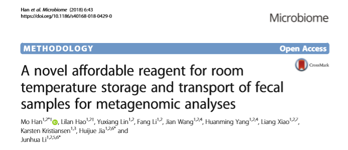
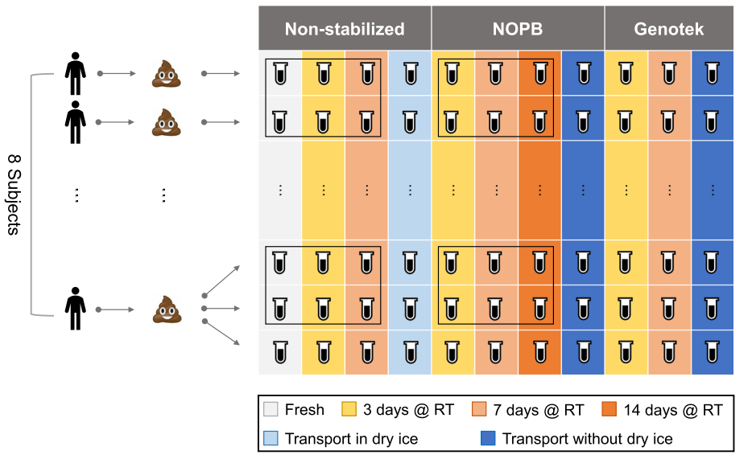
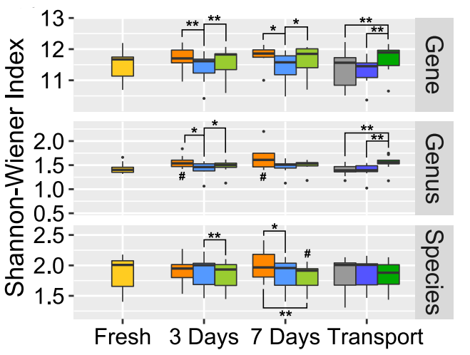
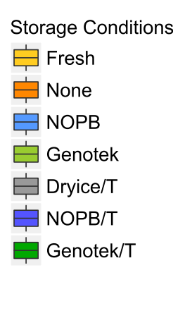
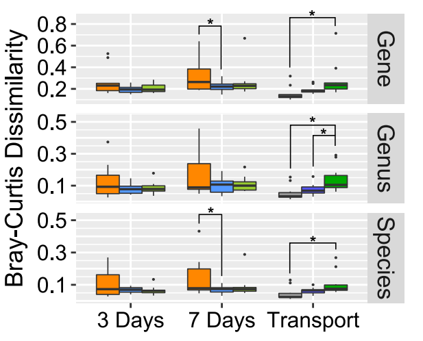
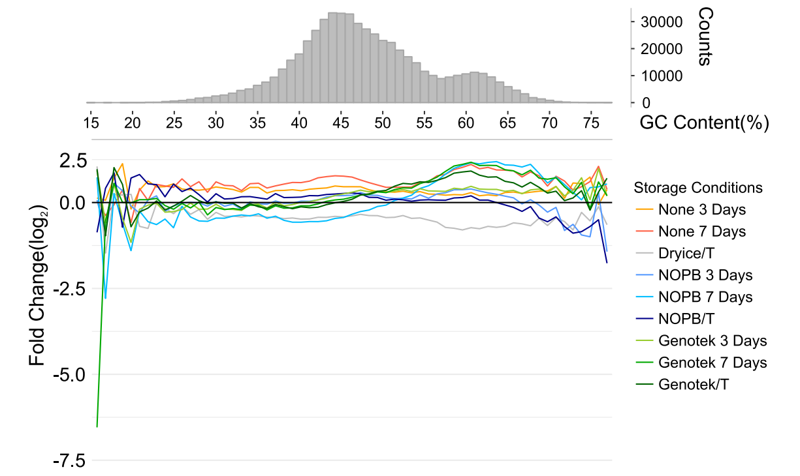
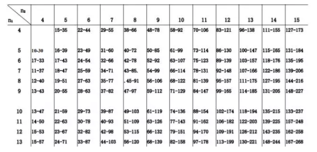

<a name="content">目录</a>

[宏基因组基本分析思路](#title)
- [1. 实验设计](#experimental-design)
- [补充知识](#supplimentary)
    - [*1. 室温存储样本方法比较](#storage-methodes-comparasion)
    - [*2. 多样性测序样本重复问题](#sample-duplication-for-diversity-analysis)

<h1 name="title">宏基因组基本分析思路</h1>

<a name="experimental-design"><h2>1. 实验设计 [目录](#content)</h2></a>

设计一个可以产生有意义的数据的实验是分析的第一步

1、为了保证实验结果之间的可比较性，以及实验的可重复性，请遵守标准操作规范，以及尽量详实地记录实验和样本的metadata

> （1）实验与取样：请遵守MIxS（Genome Standards Consortium minimum information standards）对marker genes(mImARKS) 和 metagenomes (mImS)中的实验与取样指导规则——使得不同数据集结果可以进行横向比较
>
> （2）生信分析：使用的软件及其对应版本，具体使用的命令——推荐使用 Jupyter Notebooks 和 R Markdown；将原始数据和metadata公开发布到网上

2、前期实验设计过程中的取样、保存和存储过程中的注意事项：

> **（1）考虑样品的组成**——存在较大污染时需要先过滤污染物
>
> 当样品中包含大量的非微生物DNA污染时，需要在进行宏基因组鸟枪法测序之前，去除非微生物DNA污染；
>
> 如果样品被死亡微生物等DNA遗迹严重污染（如土壤样品），则需要在提取DNA之前使用物理方法来去除遗迹DNA（relic DNA），例如使用单叠氮化丙锭或其他方法；
>
> **（2）取样量**
>
> 收集的样本量也取决于样本类型，比如生物量较高的粪便样品可能只需要使用拭子、棉棒；
>
> 而微生物密度较低的样品可能需要较大的体积或浓度才能获取足够的DNA，例如，海洋微生物群落样品通常需要大量的水进行过滤，才能浓缩并获取足够的物质进行DNA提取；
>
> 注意：在任何情况下，都应该考虑到需要采用合适的措施来控制取样过程中的污染物，污染物可能由试剂或操作仪器引入
>
> **（3）样品的保存**
>
> 宏转录组样本在保存时，需要加入RNA酶抑制剂；
>
> 宏代谢组样本在保存时需要同时兼顾代谢物的提取和数据的搜集；
>
> **（4）原始数据的采集**
>
> 对环境样本进行取样的同时，需要将取样来源环境的metadata记录下来，包括pH、盐度、海拔、取样深度等

3、需要对混杂因素（confounding factors）进行控制，很多混杂因素，如果没有得到很好的控制，会干扰我们的微生物组数据分析，目前推荐的解决方案有：

> （1）尽可能地搜集各个样本群体的元数据 (metadata)，然后在随后的比较分析中将它们考虑进去
>
> 
>
> 按年龄、性别、饮食和生活方式等潜在的混杂因子分层(分组/分类 stratification)可以部分解决由于混杂效应掩盖组间真实差异的问题
>
> （2）进行单一环境微生物群多时间点采样的纵向比较
>
> 
>
> 即可以控制混杂因子，又可以评估群体的稳定性

4、要定义实验的范围，以及选择合适的实验设计来契合自己感兴趣的科学问题

> - **横断面研究（cross-sectional）**
>
>   发现不同人群（such as healthy individuals and those with diseases, or individuals living in different geographic regions）中微生物组群落组成差异的有效方法
>
>   然而除了我们所感兴趣的疾病原因之外，个体之间微生物组较大差异的原因也可能是由于饮食、生活习惯以及药物等所致，例如，例如糖尿病患者微生物组变化的研究表明可能与二甲双胍等药物作用相关，也并疾病的影响因素相对较小
>
> - **纵向研究（longitudinal studies）**
>
>   对同一个样本，按照固定的时间间隔进行多次采样，需要对采样的时间点严加控制，对于人类研究来说，即意味着需要在相同的时间点收集样品
>
>   微生物群落的不稳定性，而不是单一时间点的特定分类水平的微生物，预测疾病状态的能力更强，如IBD（炎症性肠道疾病）疾病患者微生物组成比对照组波动更大

<a name="supplimentary"><h2>补充知识 [目录](#content)</h2></a>

<a name="storage-methodes-comparasion"><h3>*1. 室温存储样本方法比较 [目录](#content)</h3></a>

样本数：来源于8名志愿者的共110份样本。7名志愿者的粪便样本各自被均分为11份；第8名志愿者的粪便样本被均分为33份。共110份样本

分组方法：110份样本被分为了无保存液组(Non-stabilized)，NOPB保存液保存组和Genotck保存组

注：

> Genotek是目前一款商品化的粪便样本保存液，目前在科研项目中已有较多的应用，成本较高。
>
> 此外，该文章还设计了时间组，即新鲜样本(fresh) pk 3天组 pk 7天组

这还没完，还有干冰运输组和非干冰运输组的比对

结论：

- 有保存液优于无保存液

    | ` ` | ` ` |
    |:---:|:---:|
    ||  |

    当保存时间至7天时，Species水平上，有保存液样本明显优于无保存液样本

    | ` ` | ` ` |
    |:---:|:---:|
    ||  |

- 对于GC含量不同的基因片段，不同的保存方法影响不一

    

总的来说：

> - 新鲜的样本就是好！粪便样本还是应该新鲜处理
>
>    保存液能降低时间对样本的影响，而不是消除！
>
>    新鲜的样本 优于 3天的样本！3天的样本 优于 7天的样本！
>
> - 干冰运输 优于 保存液运输？
>
>    从该文的几张图中表现出了干冰运输优于保存液运输，那么如果是干冰+保存液运输呢？是否更优呢？

<a name="sample-duplication-for-diversity-analysis"><h3>*2. 多样性测序样本重复问题 [目录](#content)</h3></a>

问题：

> 每个分组在没有重复情况下，是否可以做多组（或者两组）间差异分析？

组间差异检验方法有多种类型，简单来说，包括有参和无参两种检验方法：

> - 有参检验方法：如t检验、方差分析等，无论是t检验还是方差分析，都需要算组内均值与方差，这在没有组内重复的情况下，难以实现（或非常没有统计意义）
>
> - 无参检验方法：常用的有秩和检验，而秩和检验，临界值表格都是从至少2个重复开始才有数值，也就是单分组至少2个重复才有统计意义，但实际上，多种数据表明，秩和检验每组至少5个重复（如wilcoxon秩和检验，图1），才有可靠的统计学意义
>
>   

---

参考资料：

(1) Knight R , Vrbanac A , Taylor B C , et al. Best practices for analysing microbiomes[J]. Nature Reviews Microbiology, 2018

(2) [何茂章阅读笔记](https://note.youdao.com/share/mobile.html?id=1070e1e78a8e1d7d8b7049f160bbd523&type=note&from=timeline)

(3) [超强综述 | Rob Knight等手把手教你分析菌群数据(全文翻译1.8万字)](https://mp.weixin.qq.com/s/OqxJylXYf8YHISt75azgqQ)

(4) Quince C, Walker A W, Simpson J T, et al. Shotgun metagenomics, from sampling to analysis[J]. Nature Biotechnology, 2017, 35(9):833.

(4) Mo Han, Lilan Hao, Yuxiang Lin, et al. A novel affordable reagent for room temperature storage and transport of fecal samples for metagenomic analyses[J]. Microbiome, 2018, 6:43.

(5) [用顺丰寄便便，可以吗？最新室温存储样本宏基因组学研究文章](https://mp.weixin.qq.com/s/QxdQJp4N8UNYLI7xpGOqMA)
